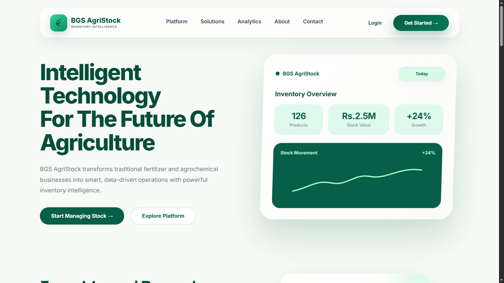
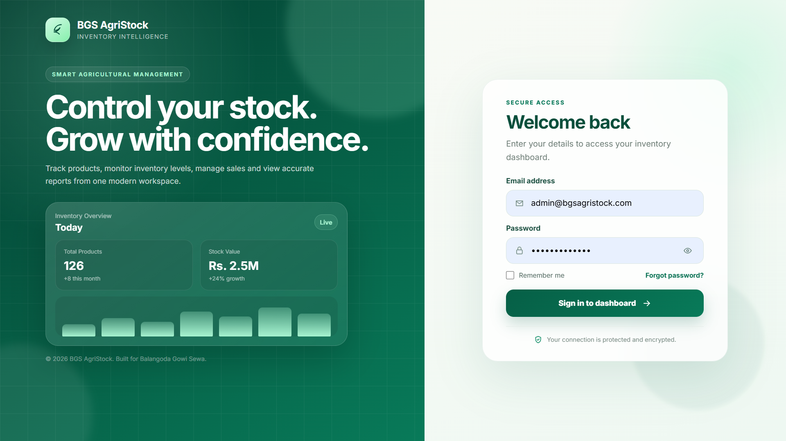
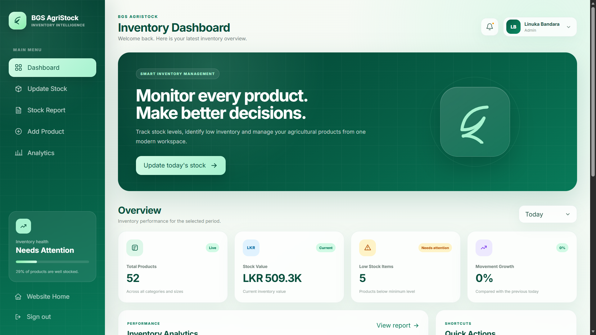
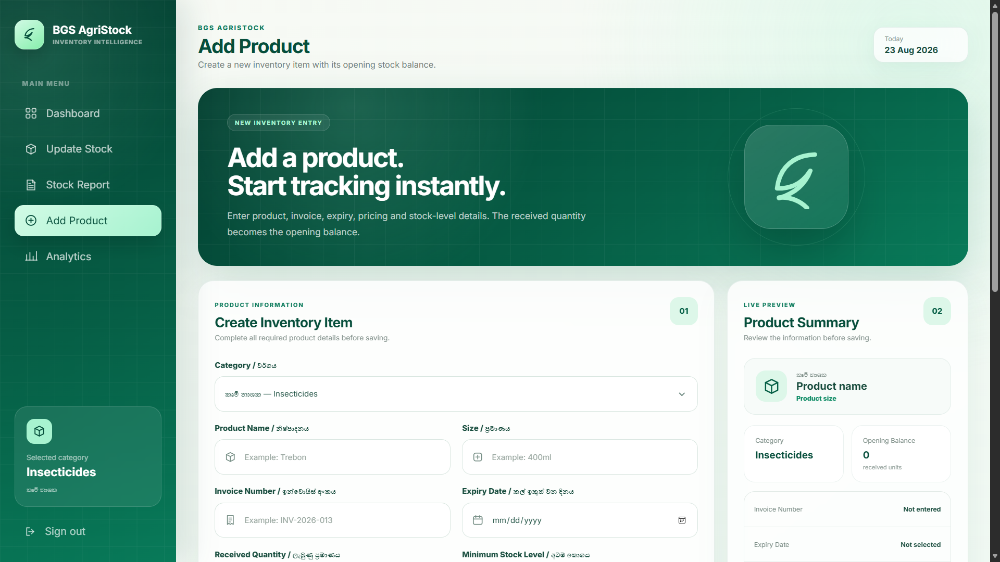
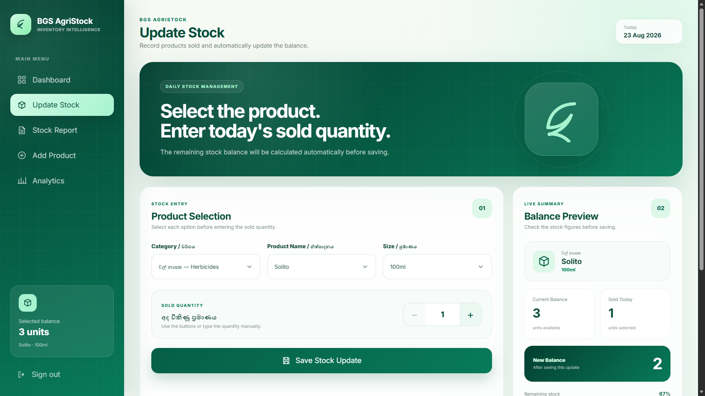
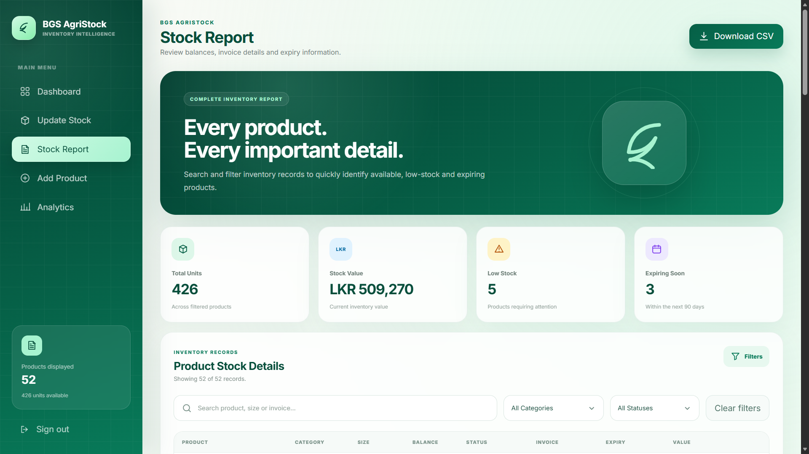
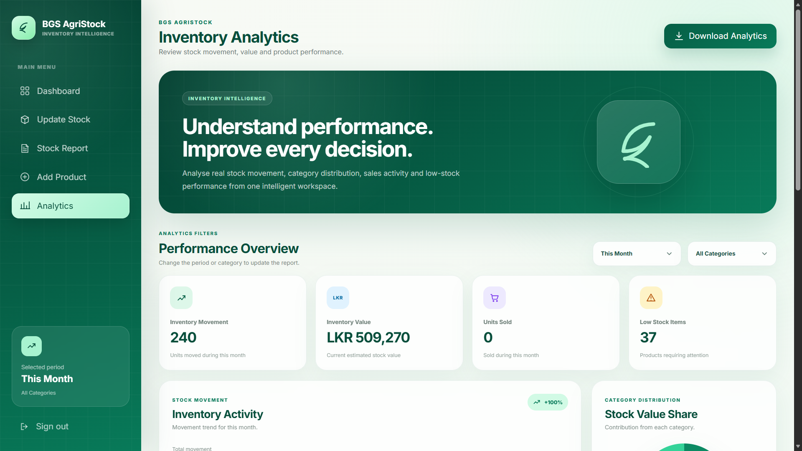

# BGS AgriStock

**BGS AgriStock** is a full-stack agricultural inventory management system built for **Balangoda Gowi Sewa**, an agricultural products business in Balangoda, Sri Lanka.

It replaces manual stock records with a centralized web application for managing agricultural products, tracking stock movements, monitoring low-stock items, maintaining inventory reports, and analyzing business activity.

> Portfolio project focused on applying full-stack software engineering concepts to a real-world inventory management problem.

## Highlights

- 🔐 JWT authentication with bcrypt password hashing
- 📦 Agricultural product and inventory management
- 🔄 Sales and restocking workflows
- 📊 Inventory dashboard and analytics
- 📋 Searchable and filterable stock reports
- ⚠️ Low-stock monitoring and inventory health indicators
- 🧾 Invoice and expiry information tracking
- 🗂️ Category and product-size organization
- 🛡️ Protected frontend routes and backend API endpoints
- 🗄️ MySQL database integration
- 📱 Responsive web interface

## Screenshots

### Public Home



### Administrator Login



### Dashboard



### Add Product / Stock



### Update Stock



### Stock Report



### Analytics



## Problem & Solution

### The problem

Agricultural retail businesses can rely heavily on manual records to track incoming stock, sales, remaining quantities and low-stock products. This makes it harder to identify inventory problems quickly and maintain a reliable view of current stock.

### The solution

BGS AgriStock provides a centralized inventory system where an administrator can:

1. Add agricultural products and define minimum stock levels.
2. Record stock received and products sold.
3. Automatically update available quantities.
4. Search and filter inventory through stock reports.
5. Identify low-stock and out-of-stock products.
6. Monitor inventory value and movement through analytics.

## Core Features

### Authentication

- Administrator login
- JWT-based authentication
- bcrypt password hashing
- Protected application routes
- Protected API endpoints
- Secure sign-out

### Inventory Management

- Add agricultural products
- Organize products by category
- Support different product sizes
- Store invoice numbers and expiry dates
- Configure minimum stock levels
- Prevent duplicate product/category/size combinations

### Stock Operations

- Record sales
- Validate available stock before selling
- Restock existing products
- Update invoice and expiry information
- Automatically maintain available balances
- Record stock movement activity

### Reporting

- Complete inventory overview
- Product search
- Category filtering
- Stock-status filtering
- Received and available quantity tracking
- Low-stock and out-of-stock identification

### Analytics

- Product distribution summaries
- Inventory value monitoring
- Stock movement statistics
- Category-level insights
- Recent activity tracking
- Inventory health indicators

## Technology Stack

| Layer | Technology |
| --- | --- |
| Frontend | React 19, Vite |
| Routing | React Router |
| State | React Context API |
| Backend | Node.js, Express 5 |
| Database | MySQL |
| Authentication | JWT |
| Password Security | bcrypt |
| Configuration | dotenv |
| Styling | HTML5, CSS3 |
| Development | VS Code, PowerShell, WAMP |
| Version Control | Git, GitHub |

## Architecture

```text
                    BGS AgriStock
                          |
              +-----------+-----------+
              |                       |
         React Frontend         Express API
              |                       |
              |                 JWT Authentication
              |                       |
              +---------- HTTP -------+
                                      |
                                      v
                                    MySQL
```

The frontend handles the user interface, navigation, authentication state and inventory views. The Express backend exposes protected API endpoints and coordinates database operations. MySQL provides persistent storage for products, users and activity data.

## Project Structure

```text
BGS-AgriStock/
│
├── backend/
│   ├── middleware/
│   │   └── auth.js
│   ├── routes/
│   │   ├── activities.js
│   │   ├── auth.js
│   │   └── products.js
│   ├── createAdmin.js
│   ├── db.js
│   ├── index.js
│   ├── schema.sql
│   ├── seed.js
│   └── package.json
│
├── public/
├── src/
│   ├── assets/
│   ├── components/
│   ├── context/
│   ├── pages/
│   │   ├── AddProduct.jsx
│   │   ├── Analytics.jsx
│   │   ├── Dashboard.jsx
│   │   ├── Home.jsx
│   │   ├── Login.jsx
│   │   ├── StockReport.jsx
│   │   └── UpdateStock.jsx
│   ├── services/
│   ├── utils/
│   ├── App.jsx
│   └── main.jsx
│
├── docs/
│   └── screenshots/
│
├── .gitignore
├── index.html
├── package.json
└── vite.config.js
```

## Application Routes

```text
/                 Public home page
/login            Administrator login
/dashboard        Inventory dashboard
/update-stock     Record product sales
/stock-report     View and filter inventory
/add-product      Add new products
/analytics        Inventory analytics
```

Protected application routes require administrator authentication.

## API Overview

```text
POST   /api/auth/login
GET    /api/products
POST   /api/products
PATCH  /api/products/:id/sell
PATCH  /api/products/:id/restock
GET    /api/activities
```

Protected API endpoints require a valid JWT bearer token.

## Local Development

### Prerequisites

- Node.js
- npm
- MySQL or WAMP Server
- Git

### Clone the repository

```bash
git clone https://github.com/linuka7/BGS-AgriStock.git
cd BGS-AgriStock
```

### Install frontend dependencies

```bash
npm install
```

### Install backend dependencies

```bash
cd backend
npm install
```

## Database Setup

1. Start MySQL using WAMP Server or another MySQL service.
2. Open phpMyAdmin or MySQL Workbench.
3. Create a database named `bgs_agristock`.
4. Import `backend/schema.sql`.
5. Optionally run the seed script:

```bash
node seed.js
```

## Environment Configuration

Environment files are excluded from GitHub.

Create `backend/.env`:

```env
PORT=5000
DB_HOST=localhost
DB_USER=root
DB_PASSWORD=
DB_NAME=bgs_agristock
JWT_SECRET=replace_with_a_long_secure_random_secret
ADMIN_NAME=Administrator
ADMIN_EMAIL=admin@example.com
ADMIN_PASSWORD=replace_with_a_secure_password
```

Create `.env` in the project root:

```env
VITE_API_URL=http://localhost:5000/api
```

Never commit real credentials, passwords or JWT secrets.

## Run the Application

Start the backend in one terminal:

```bash
cd backend
node index.js
```

The API runs at:

```text
http://localhost:5000
```

Start the frontend from the project root in another terminal:

```bash
npm run dev
```

The Vite development server normally runs at:

```text
http://localhost:5173
```

## Security

- Passwords are hashed before storage.
- Authentication uses signed JWT access tokens.
- Protected frontend routes require an authenticated session.
- Protected backend routes require a bearer token.
- Environment files are excluded through `.gitignore`.
- Duplicate product combinations are restricted at the database level.

## Project Status

**Core application complete.**

The current repository contains the main full-stack inventory workflow including authentication, product management, stock sales, restocking, reporting, analytics and MySQL persistence.

A temporary hosted demonstration may be available during development. The production hosting arrangement is intentionally not treated as a permanent portfolio dependency and can be updated later without changing the application itself.

## Future Improvements

- Multiple employee accounts
- Role-based permissions
- Supplier management
- Sales invoice generation
- Barcode scanning
- Email/SMS low-stock notifications
- PDF and Excel exports
- Automated database backups
- Mobile application support

## Author

**Linuka Bandara**  
Higher Diploma in Computing and Software Engineering

GitHub: https://github.com/linuka7

## Repository

https://github.com/linuka7/BGS-AgriStock

## Notice

Developed as an educational, portfolio and real-business inventory management solution for agricultural retail operations.
